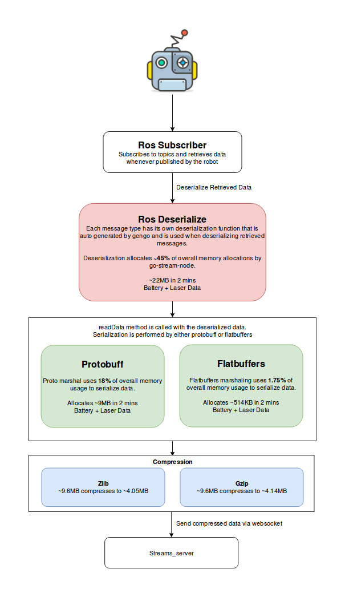

# Profiles
This directory contains the profiling data of CPU and Memory usages of the go-stream-node. This README also contains comparison between various serialization methods and the reason for going with Protobuff. Profiling helps identify costly functions that are using excessive memory or CPU time. Go profiling tool Pprof samples the node at a default rate of 100hz. Pprop works by stopping the program at the above specified rate during the execution and checks for functions running at that particular frame. The rate can be changed to a bigger number to increase the sample size.

Profiling can be done in couple of ways. We can either create a benchmark and run profiling on the benchmark or we can just profile the entire program. Below profiles mostly include the entire program.

To run the program with profiling enabled, use the following commands:
```
go-stream-node -profile.mode=cpu
go-stream-node -profile.mode=memory
```

CPU and memory profiles are automatically save in `profiles/cpu/cpu.pprof` and `profiles/memory/mem.pprof`. In order to see the metrics in the files, you can use the below commands.

For CPU:
```
go tool pprof profiles/cpu/cpu.pprof
```
For memory:
```
go tool pprof --alloc_space profiles/memory/mem.pprof
go tool pprof --inuse_space profiles/memory/mem.pprof
```
After running one of the above commands and opening the pprof tool, use the following command to list the top highest allocating/timetaking functions.
```
(pprof) top
```
In order to list out the time or memory usage of a particular function, use the following command.
```
(pprof) list <space> name of your func
```
To save the profile in a illustrated execution tree, use the following command in pprof.
To save as a PDF:
```
(pprof) pdf > yourFileName.pdf
```
To save as a svg:
```
(pprof) svg > yourFileName.svg
```

## CPU
As mentioned above, the CPU profiler collects samples of CPU usage and then give us the list of functions and their times. A sample list of top 3 functions is as following.
```
File: go-strm-old.test
Type: cpu
Time: Oct 23, 2018 at 12:26pm (PDT)
Duration: 1mins, Total samples = 1.03s ( 1.72%)
Entering interactive mode (type "help" for commands, "o" for options)
(pprof) top 3
Showing nodes accounting for 760ms, 73.79% of 1030ms total
Showing top 3 nodes out of 69
      flat  flat%   sum%        cum   cum%
     620ms 60.19% 60.19%      620ms 60.19%  runtime.futex
      90ms  8.74% 68.93%       90ms  8.74%  runtime.usleep
      50ms  4.85% 73.79%      460ms 44.66%  runtime.notetsleep_internal
```
In the above example, flat represents the CPU usage of a function alone and cum represents the cumulative sum of CPU usages of a function and its children.

## Memory
The memory profiler gives us information regarding the total allocated space and inuse space. A sample list of top 3 functions in the total allocated space profile is as following.
```
File: go-strm-old.test
Type: alloc_space
Time: Oct 23, 2018 at 12:27pm (PDT)
Entering interactive mode (type "help" for commands, "o" for options)
(pprof) top 3
Showing nodes accounting for 10MB, 52.25% of 19.14MB total
Showing top 3 nodes out of 43
      flat  flat%   sum%        cum   cum%
       4MB 20.90% 20.90%        4MB 20.90%  go-strm-old/vendor/github.com/akio/rosgo/ros.(*defaultSubscriber).start
       3MB 15.68% 36.58%        3MB 15.68%  bytes.makeSlice
       3MB 15.67% 52.25%        3MB 15.67%  time.NewTimer
```

## Optimizations
These are the changes that have been made that positively impacted the CPU and memory usages.

### Branch [context-benchmarks](https://github.com/cjds/go-stream-node/commit/be4cfecb20f6964ad127424d5d1e02c961208e1c):
#### Changes Made:
These are the changes that have been made in the context-benchmarks branch.
* Removed go routines for each listener as ros.Node automatically runs each of the listeners in their own go routines. Otherwise causes a data race.
* Running the sm.readData callback as a go routine which allows the callback job queue to be non-blocking. Check below images to see the difference.
* Serializing the data as binary instead of JSON marshalling. To see the difference in usage check `context-benchmark-alloc-space.pdf` and `master-alloc-space.pdf` in `stats/memory`. Profiling made at 150hz data rate and 60s duration.

Note that profiler's CPU and memory usage is also included in the metrics.
## Comparisons
In this section, we will be comparing various methods or libraries and give the reason why we chose a specific method or library.  

### Protobuf vs Flatbuffers vs Gob vs Json
We considered the above serialization methods to find the method that has a low payload size and did not incur high CPU and memory usage. Protobuf has been implemented in go-stream-node for serialization because of its ease of use and data size. A separate branch with Flatbuffers implementation is also added so that it can servce as a reference in future if there is a requirement to switch from Protobuf to Flabuffers.

#### Json
Json allows simple and easy method of marshaling and unmarshaling a struct. Although Json has a simple usage and human friendly encoding, it also has the largest payload size of all the 4 serialization methods. An uncompressed battery state message after marshaling has a size of 327 bytes in Json where as a the same message has a size of 42 bytes in Protobuff.
With message types like LaserScan, the payload data size grows sharply. Even after compressing using zlib or gzip, the payload size remains one of the largest. This was one of the key reasons to not considering Json as a serialization method for streaming data from the robot.

#### Gob
Gob is Go's binary serialization package and is available as part of the GO package. Gob can be used to serialize GO to GO communications. Since the streams server is also built in GO, Gob can be easily used to serialize streams messages. Gob has inbuilt registers which help in serializing structs by just registering them with Gob beforehand. After serialization, the payload has a size bigger than Protobuff and Flatbuffers. Apart from the payload size, profiling CPU and memory usage suggests that Gob's CPU and memory usage is higher the other serialization methods. This is primarily because of the encoder which is created every time a new message arrives. Similar to Json, Gob has simple usage and easy serialization but its memory usage and payload is high.

#### Flatbuffers
Flatbuffers is google's serialization library which is memory efficient and takes no heap space. Flatbuffers requires pre generated Go files built from schema provided by the user. After serializing real time battery(1hz) and laser data(15hz) for 120 seconds using Flatbuffers, the following observations were made.  

Total Message Size zlib for 120seconds:  
Uncompressed Sent Bytes: 9715200 (9.7MB)        
Compressed Sent Bytes: 3045072 (3.04MB)  

Total Message Size gzip for 120seconds:  
Uncompressed Sent Bytes: 9715200 (9.7MB)     
Compressed Sent Bytes: 3086401 (3.08MB)  

Per Message Size Uncompressed:  
Laser: ~5000 Bytes  
Battery: ~52 Bytes  

Per Message Size zlib Compressed:  
Laser: ~1700 Bytes  
Battery: ~80 Bytes  

Things To Note:  
* zlib is slightly better in compressing than gzip.
* Per message size of battery grows after compression.
* Compression reduces total data size by ~68%.
* CPU usage averages at 2.7% on the robot.
* Flatbuffer has lesser total allocation and in_use space than Protobuf because it doesn't make any allocations.
* Go specific files for Flatbuffers have to be generated and additional util methods are required to add data.   

#### Protobuf   
Protobuf is another library by google for serializing data. Protobuf,unlike Flatbuffers, makes temporary memory allocations in the heap to serialize the data. Similar to Flatbuffers, Protobuf also requires Go specific files to be generated beforehand from a schema which is written in proto3 syntax. Although Protobuf is similar to Flatbuffers in requiring generated GO files, Protobuf autegenerates structs based on schema which helps in serializing data without requiring any util methods. This is similar to Json marshaling and unmarshaling which is dev friendly. After serializing real time battery(1hz) and laser data(15hz) for 120 seconds using Protobuf, following observations were made.

Total Message Size zlib for 120seconds:  
Uncompressed Sent Bytes: 9611520 (9.6MB)    
Compressed Sent Bytes: 4056096 (4.05MB)  

Total Message Size gzip for 120seconds:
Uncompressed Sent Bytes: 9638040 (9.6MB)        
Compressed Sent Bytes: 4147053 (4.14MB)  

Per Message Size Uncompressed:  
Laser: ~5000 Bytes  
Battery: ~50 Bytes  

Per Message Size Compressed:  
Laser: ~2200 Bytes  
Battery: ~60 Bytes  

Things To Note:  
* Compressed bytes of Protbuf is larger than compressed bytes of Flatbuffers(~1Mb).
* Protobuf makes allocations where as Flatbuffers doesn't make any allocations. But, this doesn't affect the overall memory usage which stays stable at .2% for both.
* Protobuf battery data is lesser than Flabuffers battery data.(zlib/gzip didn't work well for battery data.)
* Protobuf is easy to implement similar to Json.
* CPU usage averages at 2.7% on the robot.
* Go specific files have to be generated and additional util methods are not required.

#### Protobuf Vs Flatbuffers
Although Flatbuffers saves a data, the difference between the sizes is not significant enough to choose Flatbuffers over easy implementation of Protobuf. The performance of both methods are quite similar and the extra memory allocations of Protobuf doesn't affect the heap size. Flatbuffers could be a ideal serialization method where even a small improvement in the payload data size matters. Some of the key comparisons between Protobuf and Flatbuffers is given below.

Following picture shows how the data flows through the stream node:  


##### readData() Total Allocated Space In The Heap Overtime:
From the below data we can see that Flatbuffers requires lesser allocation space over time as compared to Protobuf. Protobuf allocated ~5MB of data in 120s and Flatbuffers allocated ~514KB. Please note that allocated space is just a cumulative sum of all the memory allocations. Memory allocations are typically removed after the variable goes out of scope.   

Protobuf - readData():
```
(pprof) list readData
Total: 42.59MB
ROUTINE ======================== go-stream-node.(*SubscriberManager).readData in /home/go/src/go-stream-node/subscribe-proto.go
  512.05kB     5.53MB (flat, cum) 12.98% of Total
         .          .    146:				TimeIncrement:  ms.TimeIncrement,
         .          .    147:				ScanTime:       ms.ScanTime,
         .          .    148:				RangeMin:       ms.RangeMin,
         .          .    149:				RangeMax:       ms.RangeMax,
         .          .    150:				Ranges:         ms.Ranges,
  512.05kB   512.05kB    151:				Intensities:    ms.Intensities,
         .          .    152:			},
         .          .    153:		}
         .          .    154:	default:
         .          .    155:		logrus.Info("[Subscribe] Unsupported message type")
         .          .    156:		return
         .          .    157:	}
         .          .    158:
         .     5.03MB    159:	message, err := proto.Marshal(pl)
         .          .    160:	if err != nil {
         .          .    161:		logrus.Warn(err)
         .          .    162:		return
         .          .    163:	}
```

Flatbuffers - readData():
```
(pprof) list readData 
Total: 28.68MB
ROUTINE ======================== go-stream-node.(*SubscriberManager).readDataFlatbuffer in /home/go/src/go-stream-node/subscribe-flat.go
         0   514.63kB (flat, cum)  1.75% of Total
         .          .    125:	case *power_msgs.BatteryState:
         .          .    126:		by = flatmessages.MakeBatteryState(b, msg.(*power_msgs.BatteryState))
         .          .    127:	case *std_msgs.String:
         .          .    128:		by = flatmessages.MakeMsgString(b, msg.(*std_msgs.String))
         .          .    129:	case *sensor_msgs.LaserScan:
         .   514.63kB    130:		by = flatmessages.MakeLaserScan(b, msg.(*sensor_msgs.LaserScan))
         .          .    131:	default:
         .          .    132:		logrus.Info("[Subscribe] Unsupported message type")
         .          .    133:		return
         .          .    134:	}
         .          .    135:
```

##### Top Memory Consuming Functions:
We can observe from the below profiling data that both Protobuf and Flatbuffers have a lot in similar in terms of memory allocations. Both in Protobuf and Flatbuffers, binary read and deserialization methods are the major allocating functions since large message types like LaserScan are deserialized and allocated in the heap before marshaling into appropriate byte[] data. proto.Marshal is one of the major allocators in the go stream node that uses Protobuf unlike in Flatbuffers where it does not allocate or copy any data. Flate, which is the compression method used by zlib and gzip to compress the resultant Protobuf or Flatbuffers byte data lists in the top 10.

Protobuff - Top:  
```
(pprof) top
Showing nodes accounting for 42583.23kB, 97.65% of 43607.27kB total
Showing top 10 nodes out of 32
```
| Flat       | Flat % | Sum%   | Cum        | Cum%   | Function                                                                                                                                            |
|------------|--------|--------|------------|--------|-----------------------------------------------------------------------------------------------------------------------------------------------------|
| 11264.17kB | 25.83% | 25.83% | 12288.25kB | 28.18% | encoding/binary.Read /usr/local/go/src/encoding/binary/binary.go                                                                                    |
| 10266.27kB | 23.54% | 49.37% | 22042.46kB | 50.55% | go-stream-node/vendor/sensor_msgs.(*LaserScan).Deserialize /home/go/src/go-stream-node/vendor/sensor_msgs/LaserScan.go                              |
| 9263.33kB  | 21.24% | 70.62% | 10287.41kB | 23.59% | go-stream-node/vendor/github.com/akio/rosgo/ros.startRemotePublisherConn /home/go/src/go-stream-node/vendor/github.com/akio/rosgo/ros/subscriber.go |
| 5146.29kB  | 11.80% | 82.42% | 5146.29kB  | 11.80% | go-stream-node/vendor/github.com/golang/protobuf/proto.Marshal /home/go/src/go-stream-node/vendor/github.com/golang/protobuf/proto/table_marshal.go |
| 1805.17kB  | 4.14%  | 86.56% | 2898.68kB  | 6.65%  | compress/flate.NewWriter /usr/local/go/src/compress/flate/deflate.go                                                                                |
| 1184.27kB  | 2.72%  | 89.27% | 1184.27kB  | 2.72%  | runtime/pprof.StartCPUProfile /usr/local/go/src/runtime/pprof/pprof.go                                                                              |
| 1093.51kB  | 2.51%  | 91.78% | 1093.51kB  | 2.51%  | compress/flate.(*compressor).init /usr/local/go/src/compress/flate/deflate.go                                                                       |
| 1024.08kB  | 2.35%  | 94.13% | 1024.08kB  | 2.35%  | net.(*conn).Read /usr/local/go/src/net/net.go                                                                                                       |
| 1024.08kB  | 2.35%  | 96.48% | 1024.08kB  | 2.35%  | time.NewTimer /usr/local/go/src/time/sleep.go                                                                                                       |
| 512.05kB   | 1.17%  | 97.65% | 5658.35kB  | 12.98% | go-stream-node.(*SubscriberManager).readData /home/go/src/go-stream-node/subscribe-proto.go                                                         |  

Flatbuffers - Top:  
```
(pprof) top
Showing nodes accounting for 40084.63kB, 96.30% of 41626.54kB total
Showing top 10 nodes out of 44
```
| Flat       | Flat % | Sum%   | Cum        | Cum%   | Function                                                                                                                                                    |
|------------|--------|--------|------------|--------|-------------------------------------------------------------------------------------------------------------------------------------------------------------|
| 12865.74kB | 30.91% | 30.91% | 14401.85kB | 34.60% | go-stream-node/vendor/github.com/akio/rosgo/ros.(*defaultSubscriber).start /home/go/src/go-stream-node/vendor/github.com/akio/rosgo/ros/subscriber.go       |
| 8192.12kB  | 19.68% | 50.59% | 8192.12kB  | 19.68% | encoding/binary.bigEndian.GoString /usr/local/go/src/encoding/binary/binary.go                                                                              |
| 7699.70kB  | 18.50% | 69.08% | 7699.70kB  | 18.50% | type..hash.go-stream-node/vendor/std_msgs._MsgHeader                                                                                                        |
| 2566.57kB  | 6.17%  | 75.25% | 2566.57kB  | 6.17%  | go-stream-node/vendor/std_msgs.init <autogenerated>                                                                                                         |
| 2560.19kB  | 6.15%  | 81.40% | 2560.19kB  | 6.15%  | time.NewTimer /usr/local/go/src/time/sleep.go                                                                                                               |
| 1805.17kB  | 4.34%  | 85.74% | 2455.79kB  | 5.90%  | compress/flate.(*compressor).init /usr/local/go/src/compress/flate/huffman_code.go                                                                          |
| 1536.12kB  | 3.69%  | 89.43% | 1536.12kB  | 3.69%  | net.(*Resolver).lookupSRV /usr/local/go/src/net/lookup_unix.go                                                                                              |
| 1184.27kB  | 2.84%  | 92.27% | 3250.36kB  | 7.81%  | runtime/pprof.writeHeap /usr/local/go/src/runtime/pprof/pprof.go                                                                                            |
| 1024.12kB  | 2.46%  | 94.73% | 1024.12kB  | 2.46%  | go-stream-node/vendor/github.com/akio/rosgo/ros.(*remoteClientSession).start /home/go/src/go-stream-node/vendor/github.com/akio/rosgo/ros/service_server.go |
| 650.62kB   | 1.56%  | 96.30% | 650.62kB   | 1.56%  | compress/flate.(*compressor).deflate /usr/local/go/src/compress/flate/deflate.go                                                                            |

### Zlib vs Gzip
Before comparing zlib and gzip, it must be noted that both zlib and gzip make use of the same `compress/flate` package which implements DEFLATE compressed data format. Deflate is a lossless data compression algorithm and uses a combination of the LZ77 algorithm and Huffman coding. zlib and gzip use DEFLATE compressed data and add headers. Depending on the package, the size of the compressed bytes differs slightly because of differences in header sizes and metadata. Besides the size, both the packages differ slightly in terms of memory and CPU usages. These differences doesn't affect the overall resource usage which makes both the packages interchangeable. We are currently using zlib because of the slightly smaller data size but it can be replaced by gzip in case the perfomance deteriorates on different machines.

#### Compressed Data Size
The data size of 9.6MB of uncompressed protobuf data after compression by zlib and gzip is as following. It can be noted that zlib performs slightly better in terms of data size.  

| Compression | Data Size (~9.6MB Uncompressed) |
|:-----------:|:------------------------------:|
|     Zlib    |             ~4.05Mb            |
|     Gzip    |             ~4.14Mb            |
  
#### CPU & Memory Usage
Profiling the go stream node for 120 seconds while streaming laser and battery data, following CPU and memory usages were recorded. It can be noted that both memory and CPU usage slightly differ for both the packages. 

| Compression | Memory Usage(Total Allocation) |
|:-----------:|:------------------------------:|
|     Zlib    |            902.59KB            |
|     Gzip    |             1.16MB             |

| Compression | Avg. CPU Usage(~2.5secs sample data) |
|:-----------:|:------------------------------------:|
|     Zlib    |                 663ms                |
|     Gzip    |                733ms                 |

#### Compressing Large Data vs Small Data
Earlier it was specified that the size of the battery data increased after compression. This happens because of compressing an already small data. Several resources suggest that compressing is only efficient when the data being compressed is large and compressing data with size lesser than 150 bytes results in the compressed data size being larger than the original data. This is because the header data or the metadata added as part of the compression has a larger size than the compressed data which results in an increase of the overall size. So, it is best to avoid compressing battery data or string data and use compression only in bigger data like laser scan.
