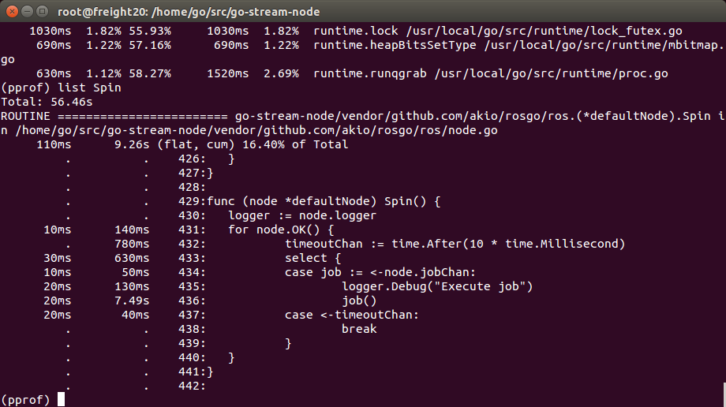

# Profiles
This directory contains the profiling data of CPU and Memory usages of the go-stream-node. Profiling helps identify costly functions that are using excessive memory or CPU time. Go profiling tool Pprof samples the node at a default rate of 100hz. Pprop works by stopping the program at the above specified rate during the execution and checks for functions running at that particular frame. The rate can be changed to a bigger number to increase the sample size.

Profiling can be done in couple of ways. We can either create a benchmark and run profiling on the benchmark or we can just profile the entire program. Below profiles mostly include the entire program.

CPU and memory profiles are automatically save in `profiles/cpu/cpu.pprof` and `profiles/memory/mem.pprof`. In order to see the metrics in the files, you can use the below commands.

For CPU:
```
go tool pprof profiles/cpu/cpu.pprof
```
For memory:
```
go tool pprof --alloc_space mem.pprof
go tool pprof --inuse_space mem.pprof
```
After running one of the above commands and opening the pprof tool, use the following command to list the top highest allocating/timetaking functions.
```
(pprof) top
```
In order to list out the time or memory usage of a particular function, use the following command.
```
(pprof) list <space> name of your func
```
To save the profile in a illustrated execution tree, use the following command in pprof.
To save as a PDF:
```
(pprof) pdf > yourFileName.pdf
```
To save as a svg:
```
(pprof) svg > yourFileName.svg
```

## CPU
As mentioned above, the CPU profiler collects samples of CPU usage and then give us the list of functions and their times. A sample list of top 3 functions is as following.
```
File: go-strm-old.test
Type: cpu
Time: Oct 23, 2018 at 12:26pm (PDT)
Duration: 1mins, Total samples = 1.03s ( 1.72%)
Entering interactive mode (type "help" for commands, "o" for options)
(pprof) top 3
Showing nodes accounting for 760ms, 73.79% of 1030ms total
Showing top 3 nodes out of 69
      flat  flat%   sum%        cum   cum%
     620ms 60.19% 60.19%      620ms 60.19%  runtime.futex
      90ms  8.74% 68.93%       90ms  8.74%  runtime.usleep
      50ms  4.85% 73.79%      460ms 44.66%  runtime.notetsleep_internal
```
In the above example, flat represents the CPU usage of a function alone and cum represents the cumulative sum of CPU usages of a function and its children.

## Memory
The memory profiler gives us information regarding the total allocated space and inuse space. A sample list of top 3 functions in the total allocated space profile is as following.
```
File: go-strm-old.test
Type: alloc_space
Time: Oct 23, 2018 at 12:27pm (PDT)
Entering interactive mode (type "help" for commands, "o" for options)
(pprof) top 3
Showing nodes accounting for 10MB, 52.25% of 19.14MB total
Showing top 3 nodes out of 43
      flat  flat%   sum%        cum   cum%
       4MB 20.90% 20.90%        4MB 20.90%  go-strm-old/vendor/github.com/akio/rosgo/ros.(*defaultSubscriber).start
       3MB 15.68% 36.58%        3MB 15.68%  bytes.makeSlice
       3MB 15.67% 52.25%        3MB 15.67%  time.NewTimer
```

## Optimizations
These are the changes that have been made that positively impacted the CPU and memory usages.

###### Changes in branch [context-benchmarks](https://github.com/cjds/go-stream-node/commit/be4cfecb20f6964ad127424d5d1e02c961208e1c):
* Removed go routines for each listener as ros.Node automatically runs each of the listeners in their own go routines. Otherwise causes a data race.
* Running the sm.readData callback as a go routine which allows the callback job queue to be non-blocking. Check below images to see the difference.
* Serializing the data as binary instead of JSON marshalling. To see the difference in usage check `context-benchmark-alloc-space.pdf` and `master-alloc-space.pdf` in `profiles/memory`. Profiling made at 150hz data rate and 60s duration.

Note that profiler's CPU and memory usage is also included in the metrics.
sm.readData Go routine CPU usage comparision:
Data rate: 150hz
Duration: 300s
 callback function i.e sm.readData without a go routine.")



